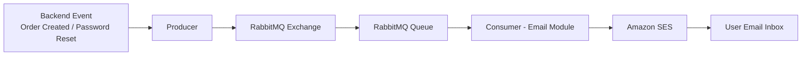

# GrowthDesk (Part 2) – Customer Website 🛒

## 1. Project Description 

**GrowthDesk** is a young retail company with 3 branches in Ho Chi Minh City. The company sells electronic products such as smartphones, computers, tech accessories, and gaming devices. To grow the business and reach more customers, GrowthDesk decided to build an e-commerce platform. This platform allows customers to easily search, view, and buy products online.

The development team built the **GrowthDesk Customer Website** to improve the online shopping experience. Customers can:

- Browse and view product information  
- Search for products  
- Add products to the shopping cart  
- Place orders quickly and easily  
- Update and manage their account information  
- ...and more!

The goal of this system is to create a simple and convenient online shopping experience for customers.

---

## 2. Database Design 🏗

---

## 3. Technologies Used ⚙️

- 🎨 Frontend: NextJS, TailwindCSS, HeroUI, Zustand, Axios. 
- 🖥️ Backend: Node.js, NestJS, RabbitMQ, Prisma.  
- 🗄️ Databases: PostgreSQL, MongoDB.  
- 🚀 DevOps: Docker, Docker Compose, Kubernetes.
- ☁️ Cloud: AWS (S3, SES, EKS, ELB, VPC, IAM,  CloudWatch) 

---

## 4. Main Pages 🧭

#### 🔐 Login Page
Users can log in using their username and password.  
This page also provides a "Forgot Password" feature.

#### 📝 Register Page
Users can create a new account by entering: Username, Email, Password, Confirm Password. 

#### 🏠 Home Page
The home page displays:
- Product categories
- Brand list
- Featured products
- Highlighted ratings and reviews

#### 📦 All Products Page
This page shows all products (In stock, Out of stock, In order). Users can use filters to easily find products based on their preferences.

#### 🧾 Order Page
The ordering process includes 3 steps:

1. **Shipping Information**: users enter delivery information such as phone number and shipping address.
2. **Payment Method**: users choose a payment method (MoMo, Cash on Delivery)
3. **Order Review & Confirmation**: users review the order details and confirm the purchase.

#### 📜 Order History Page
Displays a list of orders that the customer has purchased.

#### 🔎 Product Detail Page
Shows detailed information about a product. This page includes three tabs: Description, Specifications, Reviews  

#### 🛒 Shopping Cart Page
Displays the list of products currently in the shopping cart. Users can create an order from this page.

#### 👤 Profile Page
Displays detailed information about the user account and some features (change password, upload avatar, delete account).

#### ❤️ Wishlist Page
Displays products that users have saved as favorites. Users can also add these products directly to the shopping cart.

---

## 5. Key Features ⭐

### 🔐 Authentication & Authorization with JWT

The system uses `JWT (JSON Web Token)` for secure authentication and authorization. Login process is in 4 steps:

1. The user enters username and password.
2. The backend verifies the credentials.
3. If the login is successful, the system generates: **Access Token** and **Refresh Token** (if Access Token out of date, it will create a new one, users no need to re-signin).
4. These tokens are stored in cookies.

**Protected features**

Some features require the user to be logged in (for example: placing an order). The backend uses `NestJS Guards` to check:

- Whether the Access Token exists in the cookie.
- Whether the token is expired.
- Whether the token data has been modified.

If the token is invalid, the user cannot access that feature, and the system will display an error message.

---

### 🔑 Forgot Password Feature

Users can reset their password using the **Forgot Password** feature. Process:

1. The user clicks "Forgot Password".
2. The user enters: Username, Email.
3. The system sends a **password reset email** to the user. The email contains a **reset password link**.

**Reset Token**

The link contains a token generated by the system. This token is stored in `MongoDB` with the following information:

- `username`
- `token`
- `expiration time` (15 minutes after creation)
- `isUsed` (a flag to check if the token has already been used)

**Token validation**

If the user clicks a link with an **expired token**, the system will return an error and the user must request a **new password reset link**.

If the token is still valid:

1. The user will be redirected to the **Reset Password page**
2. The user enters: New password, Confirm password
3. The password is successfully updated.

---

### 💾 Temporary Data Storage with Zustand + Local Storage

The system uses `Zustand` to store datas in **Local Storage**. Temporary information stored includes:

- Products added to the shopping cart
- Discount codes applied by the user
- Order information, such as: Shipping address, Payment method.

This data remains in Local Storage during the shopping process. Once the user successfully completes the payment, the system clears this data.

---

### 💳 MoMo Payment Integration

The system integrates the **MoMo payment gateway** to provide a convenient payment option. Payment process:

1. The user selects MoMo as the payment method.
2. The system redirects the user to the MoMo payment page.
3. The user scans the QR code on the screen using the MoMo app.
4. After successful payment, the system confirms the order.

This provides a fast and convenient payment experience for users.

---

### 📧 Asynchronous Email System (RabbitMQ + Amazon SES)

The system uses `RabbitMQ` and `Amazon SES` to send emails asynchronously.

Emails are sent in the following situations:

- **Order confirmation** after a successful purchase
- **Password reset email** when the user requests a password change

**Message flow**:

**Benefits of this architecture**

- **Message durability**: if the backend server stops, messages remain in the queue and will be processed when the server restarts.

- **Better user experience**: after the user clicks **Place Order**, the system saves the order in the database and immediately returns a response. The user does not need to wait for the email module to finish.

- **Loose coupling between services**: the email system is independent from the main backend logic, which helps reduce errors and improve system reliability.

---

### 🖼 Avatar Upload with Amazon S3

Users can upload or delete their profile avatar. Upload process:

1. The frontend requests a **pre-signed URL** from the backend.
2. The backend generates a **temporary pre-signed URL** for uploading to `Amazon S3`.
3. The frontend uploads the image directly to S3 using this URL.

After the upload: the image path in S3 is saved in the database. The system uses a pre-signed URL to display the avatar image.

**Advantages**

- Reduces load on the backend server.
- Large files (images) are handled directly by `Amazon S3` -> Improves system performance and scalability.

---

### ☁️🚀 Deployment on AWS EKS 

The GrowthDesk system is deployed on **Amazon EKS (Elastic Kubernetes Service)** to provide scalability, reliability, and easier infrastructure management.

1. A **Virtual Private Cloud (VPC)** is created in the `us-east-1` region. The VPC spans two Availability Zones (AZs) to improve high availability. Each AZ contains:

    - **Public Subnet** – used for the Application Load Balancer
    - **Private Subnet** – used for Kubernetes Worker Nodes

-> This architecture helps protect internal services while still allowing external access through the load balancer.

2. An **OIDC Provider** is configured to connect **AWS IAM** with the EKS cluster. This enables IRSA (IAM Roles for Service Accounts) so Kubernetes Pods can securely access AWS services without storing credentials. Two IAM roles are created:

    - **GrowthDesk-NestJS-Role**: access **Amazon SES**, **Amazon S3**, manage email templates. This role is attached to NestJS Pods.
    - **GrowthDesk-ALB-Controller-Role**: manage EC2 resources, manage Elastic Load Balancers, manage AWS WAF. This role is used by the AWS Load Balancer Controller.

3. Security Groups are configured to allow inbound traffic from the Internet:

    - **Port 80 (HTTP)**
    - **Port 443 (HTTPS)**

    These ports allow users to access the system through the **Application Load Balancer**.

4. A **StorageClass** is created to dynamically provision **Amazon EBS volumes**. Stateful services are deployed using Kubernetes StatefulSets, including: PostgreSQL, MongoDB, RabbitMQ

    Each service uses **PersistentVolumeClaims (PVC)** to ensure that data remains persistent even if Pods restart.

5. Docker images for the applications are deployed to the cluster: Next.js (Frontend) and NestJS (Backend). Health monitoring is implemented using:

    - **Liveness Probes** – check if the container is still running
    - **Readiness Probes** – check if the container is ready to receive traffic

    Internal communication between services is handled using **Kubernetes Services (ClusterIP)**:

    - NextJS ↔ NestJS
    - NestJS ↔ Databases
    - NestJS ↔ RabbitMQ

6. The **AWS Load Balancer Controller** is installed inside the cluster. An **Ingress Resource** is defined so that Kubernetes automatically provisions an Application Load Balancer (ALB). The ALB routes external traffic to the correct services inside the cluster.

7. To enable secure HTTPS access, a TLS certificate is issued using **AWS Certificate Manager (ACM)**. The domain `growthdesk.site` is registered and validated. Then a **Route 53** Alias Record (Type A) is created: growthdesk.site → ALB DNS Name

    This allows users to access the website securely via: `https://growthdesk.site`

---

## 6. Video demo 

Link: [Youtube](https://www.youtube.com/watch?v=jvaBDNftrlg)
